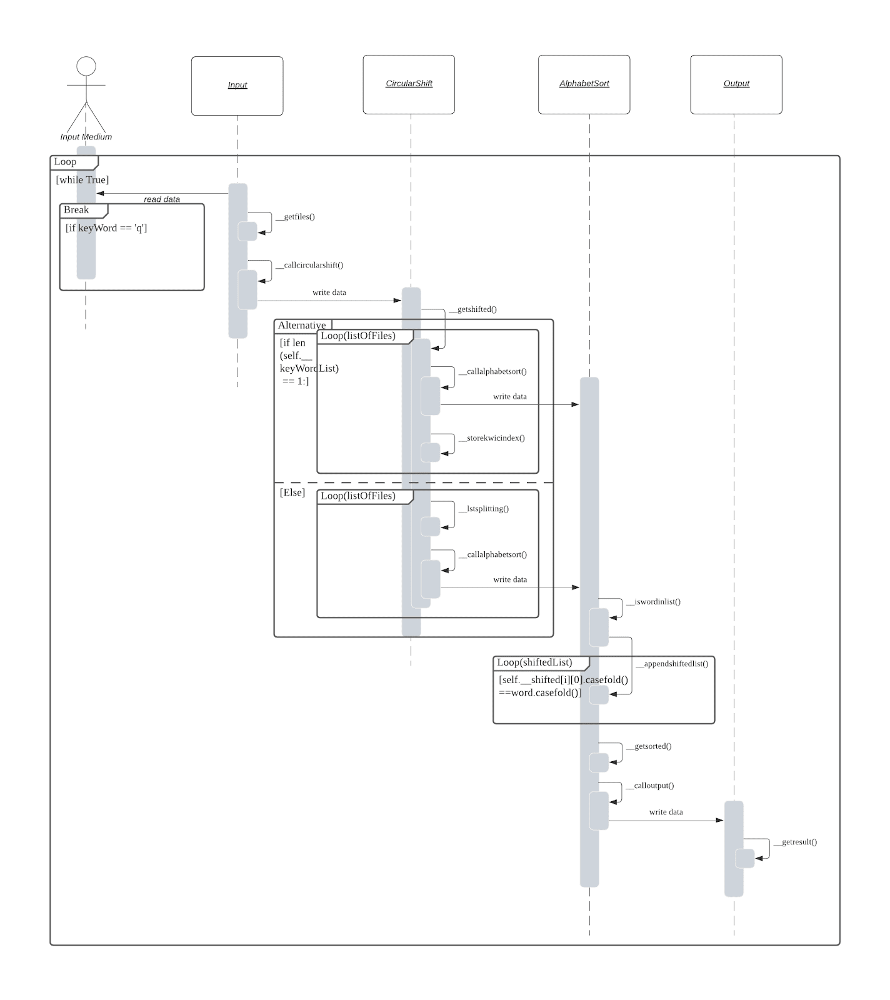
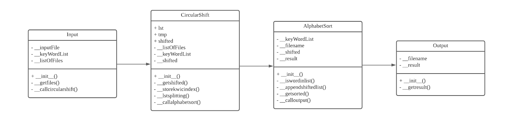
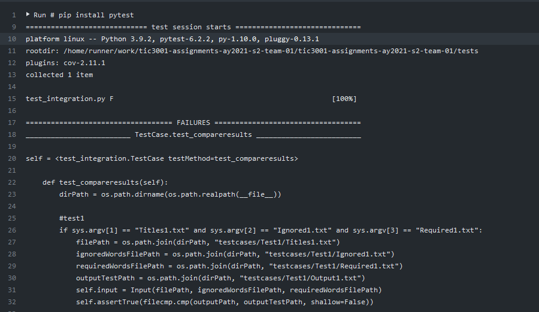
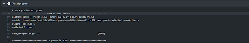

# tic3001-assignment_3_-ay2021-s2-team-01

Author: Lim Kang, Ng Xin Yi


## Introduction

This assignment is to implement a KWIC (Key Word In Context) index system. The system accepts an ordered set of lines, each line is an ordered set of word, and each word is an ordered set of characters. For each line, it shall be “circularly shifted” exhaustively by removing the first word and appending it at the end of the line to create a set of circularly shifted lines and outputs a listing of all circularly shifted lines in alphabetical order.

These are the following architectural designs that we have implemented for the KWIC system.

 - TestCases + File Reading Implementations – Ng Xin Yi
 - CI + Function Implementations - Lim Kang

## Architectural Design

The Pipe and Filter solution is an architectural design pattern that allows for stream/asynchronous processing. It connects several components, which are referred to as filters that process a stream of data, each connected to the next component in the processing pipeline via a pipe. 

If new steps are introduced into a process, it would be possible to create separate filters for those new steps. Therefore, it would be easy to grow the pipe and filter architecture. It also makes it easy to reuse filters that perform a generic action on various data sets. Another advantage is that filters don't share their state and are unaware of what other filters are doing. They only communicate through their input/output channels which reduces coupling between components.

For this design it consists of 4 components – Input, CircularShift, AlphabetSort, Output.
 - **Input** reads all the lines from **Input Medium** which is a .in file that contains filenames.
 - **Input** calls its function getfiles() to return all the lines from the text file and call callcircularshift() to pass the data to **CircularShift**.
 - **CircularShift** calls its function getshifted() and run a loop for listOfFiles and call storekwicindex()  to store KWIC index rotation of each file content and callalphabetsort() to pass data to **AlphabetSort**.
 - **AlphabetSort** calls its function iswordinlist() and run a loop for keyWordList to perform a check if the keyword(s) that the user input is in the file content list, if it exists then it will call appendshiftedlist() to append the line into a list. After the result is appended to the list, it calls getsorted() to perform alphabetical sort. After all the lines have been alphabetically sorted, it calls calloutput() to pass the data to **Output**.
 - **Output** calls its function getresult() to write it in a text file.

These actions are illustrated in the sequence diagram and class diagram as shown in the figure below.




The direct association (depicted as arrows) acts as a pipe to facilitate communication between modules.




## Applying Design Principles

**Basic Principles:**

 - **Information Hiding:**
 We have complete control over how the user manipulates the contents of the list. If they had public access to the top, they could change it in a way that breaks the
 properties of the list. Since the top is hidden from their access, they have no way of breaking the list, as long as our code is correct.
 
 - **High Cohesion:**
 The advantage of high cohesion is that such classes are much easier to maintain. The elements within the module are directly related to the functionality that module
 is intended to provide. 
 Another benefit of high cohesion is that classes with a well-focused purpose tend to be more reusable than other classes because the code for a module is all locate
 together and works together, we can easily design, write, and test our code.

**Object Oriented Class Design Principles:**

- **Single Responsible Principle:**
Every class or module in a program should have responsibility for just a single piece of that program’s functionality. Further, the elements of that responsibility should be encapsulated by the responsible class rather than spread out in unrelated classes. Not only are pieces of functionality encapsulated in their own classes, but they are organized in a manner that is both predictable and consistent.

- **Open Close Principle:**
A class/object should be open to extension but close for modification. If it is necessary to change a specific class because of new business requirements, it is better to create a new code for the changes or new functionality instead of affecting the existing one in the cases where it is possible.

Therefore, by applying these principles to our code, we have effectively:
 1. Modified the access control to private attributes and methods.
 2. Separated responsibilities into individual classes/methods and thus reduced the chances of code changes in one place breaking operations in another. It is also
 much nicer to work with when updates are needed.

## Search Using Kwic

- **KWIC Application:**

Based on user first keyword input - Split the content by files, by new line, and apply KWIC to each file, on the lines (by file and lines) then proceed to searching the keyword of the contents in a list and retrieve content to perform alphabetical sort and print the output.

Based on user subsequent keyword input – Retrieve the KWIC index (stored in a list) that was performed from user first keyword input then proceed to searching the keyword of the contents in a list and retrieve content to perform alphabetical sort and print the output.

- **File + Paragraph Handling:**

- **Design Pattern:**

We approached this with a Singleton Pattern, where each class has no more than a single instance.
These instances are called by the main class which is the main controller of the whole python package. 

This pattern is relatively the easiest to apply and it is effective with minimal extra coding required. It provides our search facility a single point of access which does not over complicate the system thus making it user friendly and easy to use.

## CI ##

These are the following reasons why we chose GitHub Actions as our continuous integration tool:
 1. It is relatively easy to use and there’s sufficient resources online to help us to fix errors.
 2. GitHub Actions's Features:
 - Multiple workflow files support
 - Free and open source
 - Workflow run interface
 - Search for actions in GitHub Marketplace
 - Integrated with Github's Checks API
 - Logs and artifacts downloading support

**Challenges Faced**
 - Trouble with linting using flake8.

**Helpful Features**
 - Automated testing and building
 - Automated checking for Syntax errors

We have created the test cases based on the test cases that were provided in Assignment 1 and 2. The test cases were based on whether the generated output was correct or wrong.
These are the following screenshots of the CI console output (Failed/Passed/Build history):

**Failed:**



**Passed**




## How to use
```
# Clone this repository

$ git clone https://github.com/TIC3001/tic3001-assignments-ay2021-s2-team-01

  
# Go into the repository

cd TIC3001_Assigment3

edit codes and push back to repo
$ git add .
$ git commit -m "Key in Message"
$ git push origin main

Under github,
1. go to actions
2. GitHubActions which is our CI tool will automatically build & test the code when it is newly pushed

```
## Excecuting test output example

